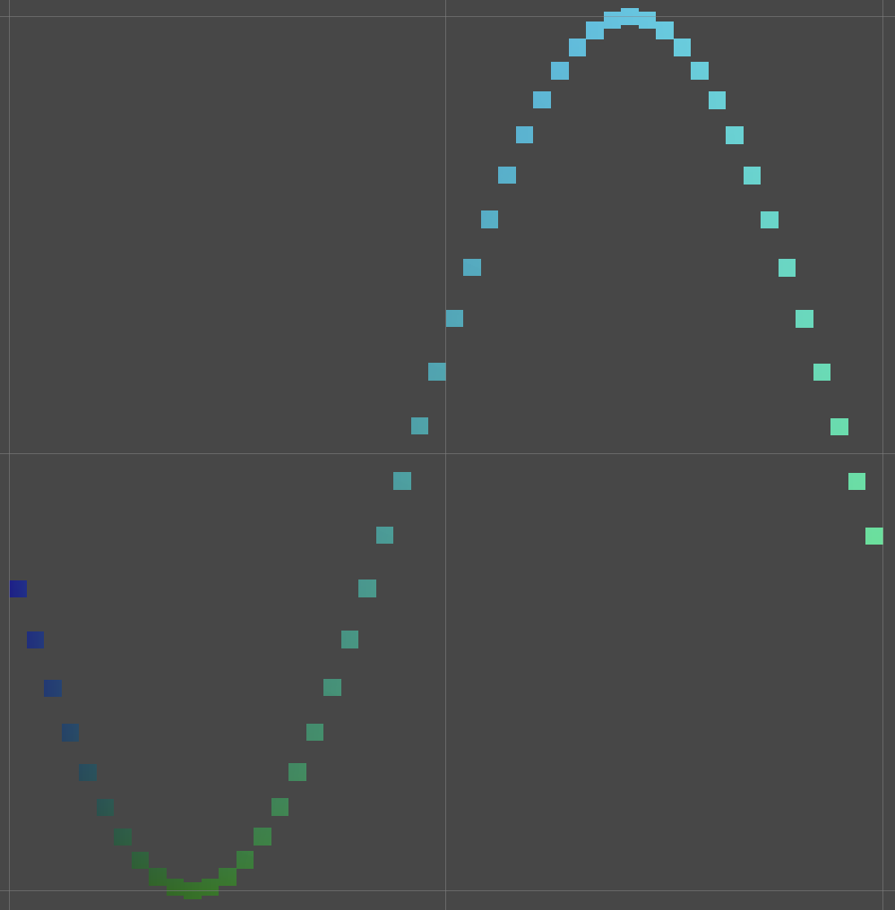
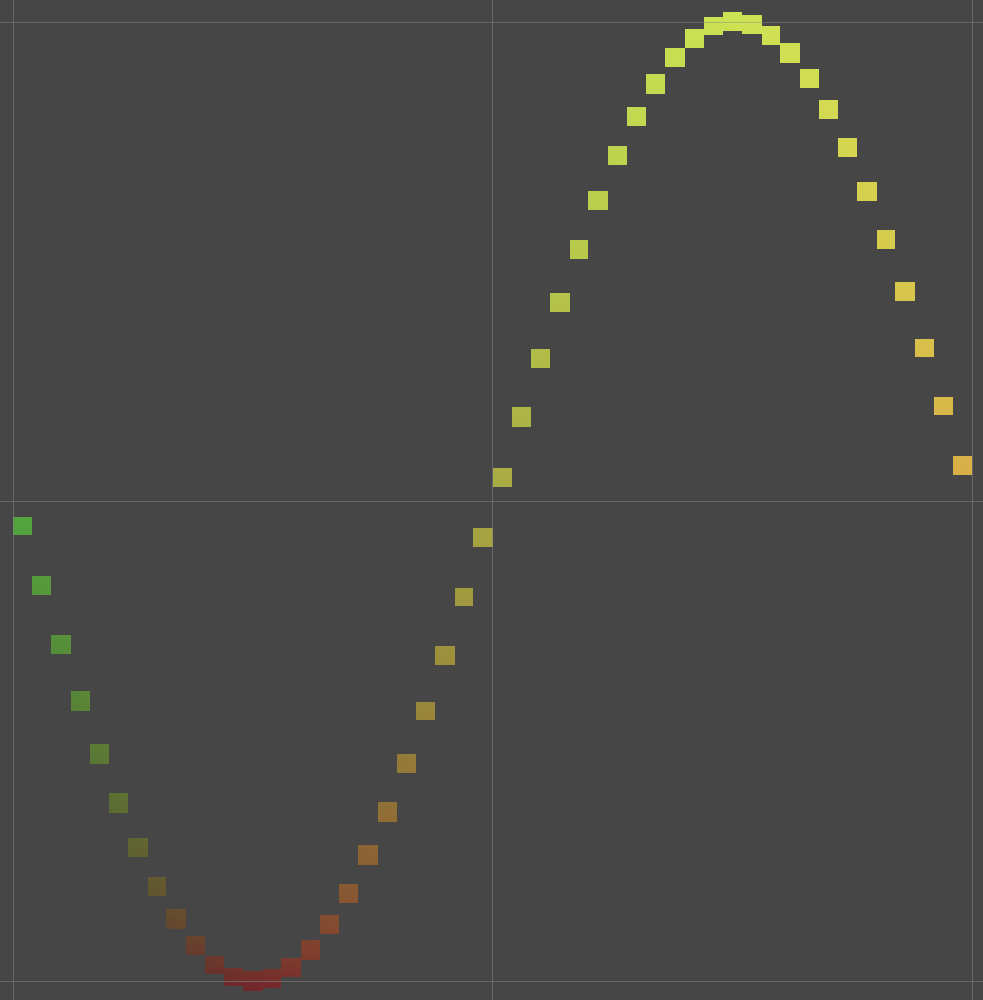
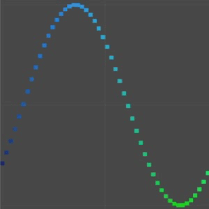
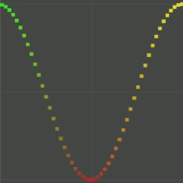

# Animating-Graph

   

## About
This is the project by [Catlike Coding's tutorial](https://catlikecoding.com/unity/tutorials/basics/building-a-graph/).   
This is an animated sine wave with changing block colours and possibility to change resolution of graph (in inspector of Graph object). There are two different shaders with different render pipelines (Point Surface - shader with default RP; Point URP - shader with Universal RP).
## Documentation
Colours in shaders depend on parameters:
* Point Surface - R and B colour components depend on X and Y.
* Point URP - R and G colour components depend on X and Y.
### How to change shaders:
* In Assets/Point you need to change the material of "Point" (prefab) to "Point Surface" or "Point URP" material.
* Change the Scriptable Renderer Pipeline Settings to needed (URP - how to create this RP see in [Notes](Notes.md) - or None (default RP)) in Edit -> Project Settings -> Graphics.
## Screenshots

  
  

  
  

Point Surface (left), Point URP (right)

## Developers
🙋‍♀️ [Anastasiia Radaeva](https://github.com/AnastasiiaRadaeva)
